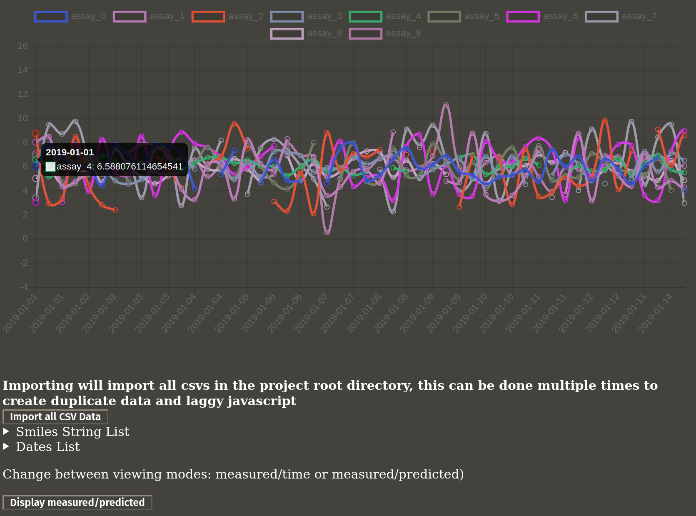

# Whats this?
Its a graph with some buttons


# Up and Running
## Just running
First see configuration and change `db_addr` to your machines local ip 

To start, run
```docker-compose -f docker-compose.yml up -d```
It takes a second for the mysql database to start, if the application is loaded (visit [127.0.0.1:8000](127.0.0.1:8000)) during that time, it may throw an error. This is fine, just wait a sec then reload the page

Once its loaded, click the "Import all CSV Data" and the page will reload
## Configuration
- The mysql settings of the local database can be changed in the `docker-compose.yml` file
- The settings that the app uses are in the `config.json` file
   - `"db": "db"` The name of the database to use
   - `"db_addr": "192.168.1.151"` The address of the mysql server
   - `"db_user": "user"` User to connect to the database as
   - `"db_password": "password"` You should know this one
   - `"db_root_user": "root"` Same deal for root info, its never used but its there
   - `"db_root_password": "password"`
   - `"x_axis_limit": -1` The limit of how many x_axis points will be displayed for easier viewing. Set to -1 to disable limit. App does not need restart for changes to limit to take effect, just refresh page
   
This allows the app to use any mysql database, so if there are multiple instances of this running they can share a database, or the database could be something other than local with easy configuration

# Whats what
Well, this is it

## Buttons
 - "Import all CSV Data"
   - Will look for all csv files in the root directory and load them into the database
   - Will happily load the same data twice as the application can handle multiple of the same smiles strings keyed data
   - Useful to update existing database with more data in future
 - "Display mode"
   - Will change the graph to display either each assay as its measured values over time or its measured values over its predicted values
 - "assay_#"
   - Click the rectangles above the graph to toggle on and off different assays to be shown
 - Smiles String list
   - Just lets you see all the smiles strings
   - If data is imported twice, it will show the same smiles string as many times as it appears in database
 - Dates list
   - List of all dates in database
   
## Design and Decisions
Database is a single table that is basically a 1:1 of the csv file, except the primary key is the smiles string + uuid to allow duplicates

The javascript graph chosen was picked because I could stick it in a django template and not have to mess with any other javascript-y bits

The database chosen is mysql because I felt like it

   
